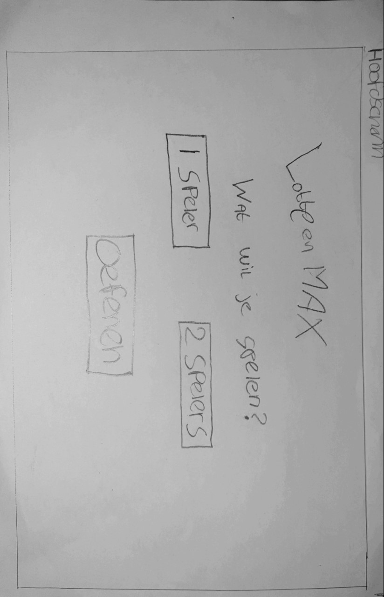
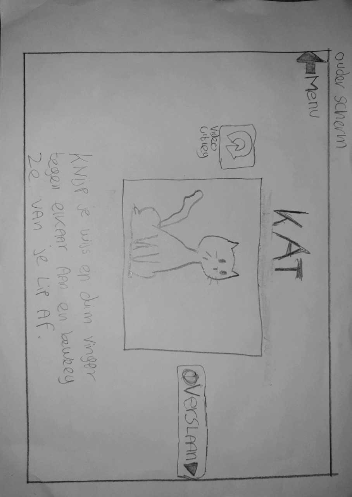
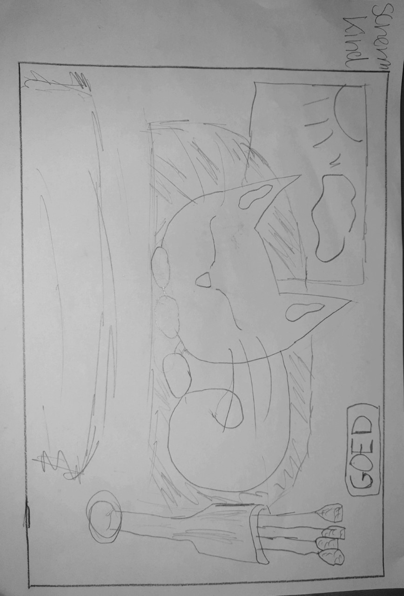
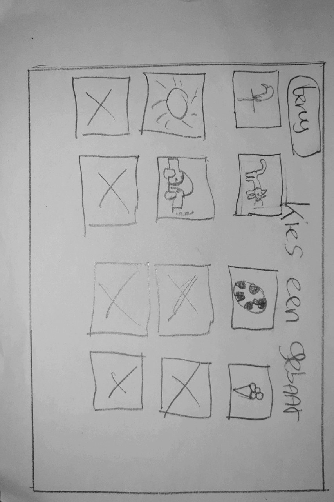
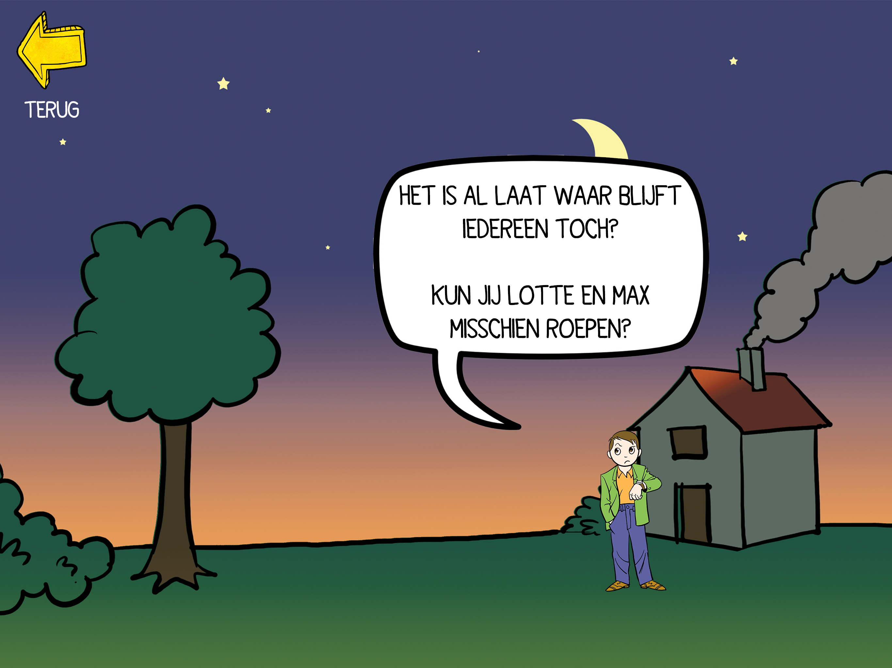
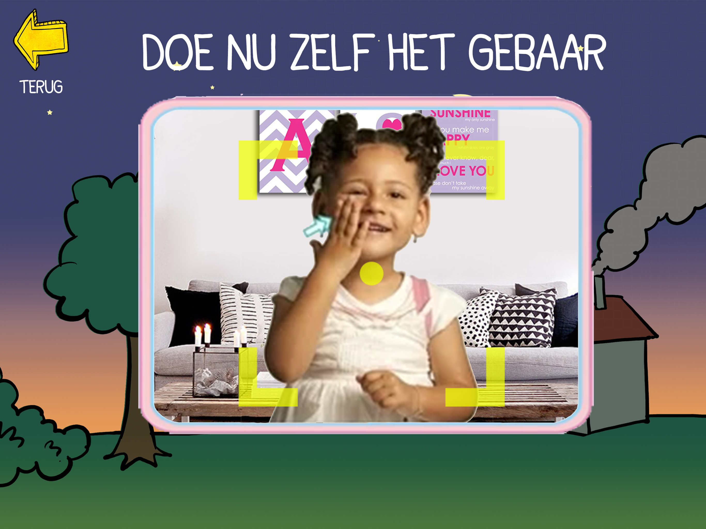
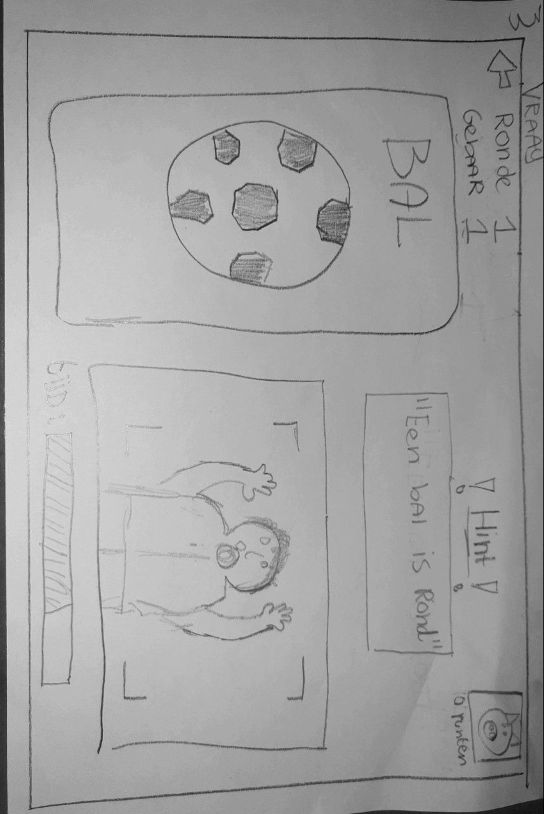
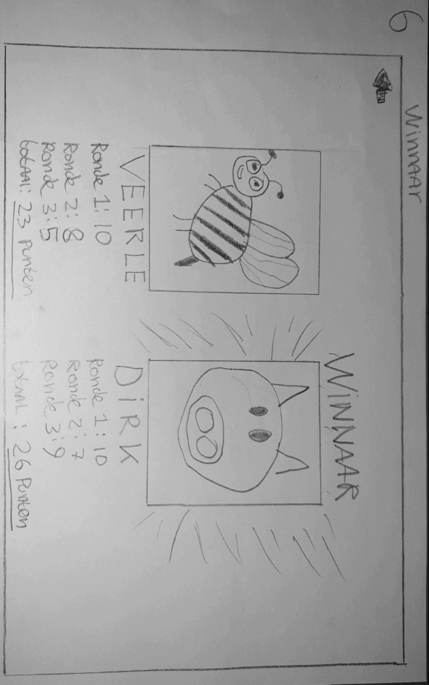
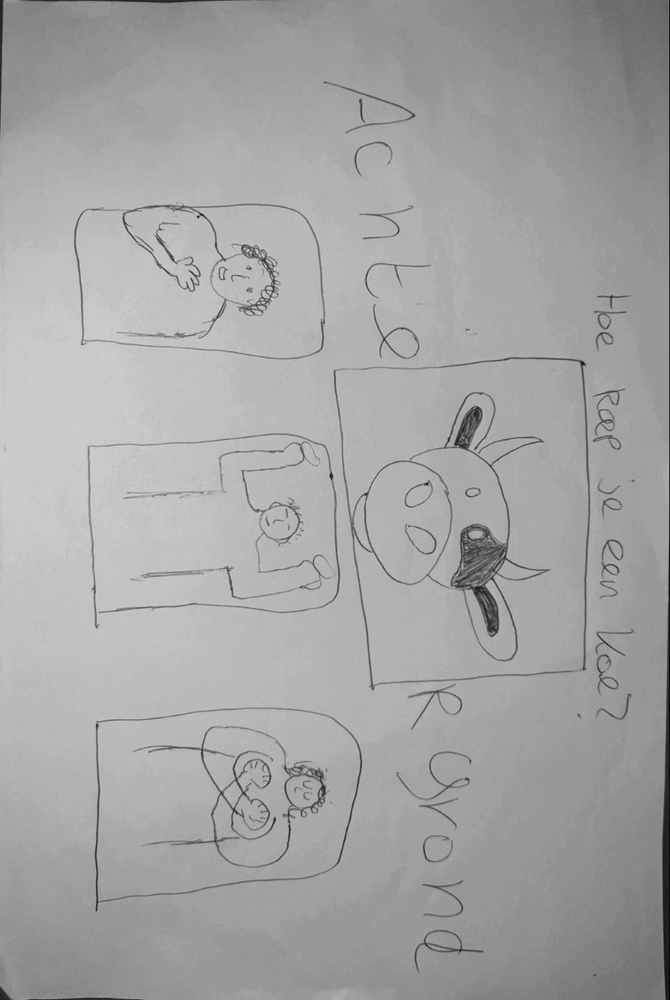
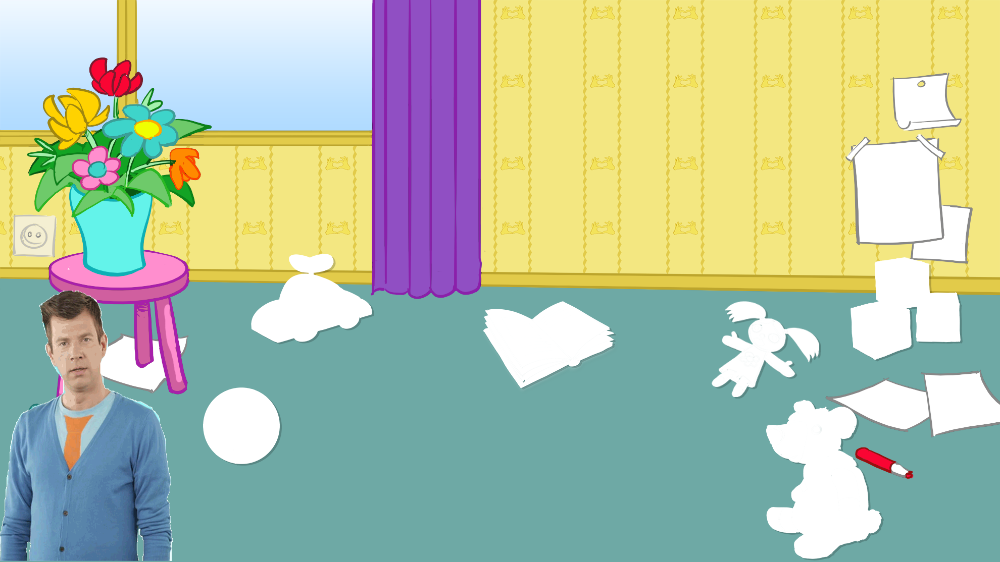

# Concepten

## Ideeëngeneratie

In de periode voor de Feedback Frenzy heb ik zowel alleen thuis als op school met mede-studenten, nagedacht over de verschillende concepten. Tijdens deze periode zijn er brainstormsessies met mijn afstudeergroepje geweest en heb ik een [**consult gesprek gehad met een expert**](https://app.gitbook.com/@lotte-and-max-app/s/lotte-en-max/~/drafts/-LyfKHRGVHYWKHpxjtJa/v/master/untitled-1/expert-consult)**.** De ideeën die hieruit zijn voortgekomen, zijn gepresenteerd tijdens de Feedback Frenzy.  \(zie ook onderaan deze pagina\). Deze ideeën en de resultaten van de Feeback Frenzy ****vindt u [**HIER**](https://app.gitbook.com/@lotte-and-max-app/s/lotte-en-max/~/drafts/-LyfKHRGVHYWKHpxjtJa/v/master/ontwikkeling/ideeen).

## Concepten

Hoewel het vooronderzoek nog niet helemaal af was heb ik, op basis van eisen vanuit de stichting en een deel van het onderzoek, drie concepten ontwikkeld. Deze worden hieronder beschreven. Ik zal uiteindelijk op basis van het resterende onderzoek een uiteindelijke keuze maken tussen deze 3 concepten.

## **Concept 1. Kind- en oudergame**

Op het moment van het ontwikkelen van dit concept hield ik nog rekening met alle leeftijden binnen de doelgroep \(2 - 6\). Dit concept is daarom ook bedoeld voor de allerjongste groep binnen de doelgroep namelijk peuters van 2 en 3.  
  
Het concept is voornamelijk gebaseerd op het feit dat jonge kinderen tijdens het leren vooral baat hebben bij een echt mens die gebaren voordoet \([**hoe leren kinderen**](https://app.gitbook.com/@lotte-and-max-app/s/lotte-en-max/~/drafts/-LyfKHRGVHYWKHpxjtJa/v/master/untitled-1/hoe-leren-kleuters)\). Het kind zal in zijn vroege levensjaren vaak de ouders na doen. Het is daarom van belang dat de ouder samen met het kind op de applicatie kan, zodat de ouder het kind kan laten zien hoe de gebaren moeten worden uitgevoerd.  

### **Uitwerking**

Een tablet-app die jonge kinderen en hun ouders snel nieuwe gebaren leert.   
De app werkt met twee verschillende interfaces. De ouder krijgt een interface met uitleg hoe bepaalde gebaren uitgevoerd moeten worden, terwijl het kind alleen het object, ziet zonder tekst, knoppen of uitleg.  
Hele jonge kinderen herkennen knoppen namelijk niet als zijnde een knop.

De ouder start het spel waarna er een willekeurige afbeelding te zien is, denk aan een autootje, een leeuw of een lampje. Vervolgens kan de ouder op de app zien hoe dit gebaar gedaan moet worden. De ouder draait de tablet om en de interface verandert zodat het kind **alleen de afbeelding** ziet.   
Nu hoeft het kind alleen het gebaar goed voor te doen en kan de ouder op een knopje \(die gespiegeld staat zodat het ondersteboven gelezen kan worden\) drukken om te bevestigen dat het gebaar goed uitgevoerd is. Vervolgens kan het kind even interacteren met de afbeelding. Het kind kan bijvoorbeeld een poes aaien of de gaat miauwen als je op haar staart klikt. Als het kind uitgespeeld is met deze omgeving draait de ouder de tablet en verschijnt het oudermenu. Hier is weer een nieuwe afbeelding te zien, gepaard met uitleg hoe deze op een juiste manier vertaald dient te worden naar gebarentaal. 

Als de ouder op het plaatje drukt verschijnt er een filmpje van een acteur uit de serie die het gebaar voor doet.

Het tweede gedeelte van deze app is bedoeld om zelfstandig nieuwe gebaren te leren. Als deze interface wordt geopend dan kan het kind scrollen tussen de verschillende afbeeldingen en doet een personage uit de serie het gebaar voor. Dit kan één van de handpoppen zijn of één van de twee acteurs die de dvd afleveringen presenteren. Als de speler genoeg heeft van het gebaar kan hij/zij op het plaatje van het object drukken om vervolgens een grote versie van het object te zien en hiermee te spelen. Als de speler bijvoorbeeld op de kat drukt zal deze wakker worden en miauwen.

Voor de volledige uitleg en onderbouwing van dit concept verwijs ik u door naar[ **de productbiografie**](https://app.gitbook.com/@lotte-and-max-app/s/lotte-en-max/~/drafts/-LyfKHRGVHYWKHpxjtJa/v/master/ontwikkeling/concept-1)\*\*\*\*

[**Link naar Mockups**](https://www.dropbox.com/sh/0xj48hgm2kecloo/AAAundgyVOHfkz7lvspX_f4Ra?dl=0)\*\*\*\*

## **Concept 2.** Motion Capture Game 

Dit concept is voornamelijk voortgekomen uit het [**expert consult met Diego Molina**](https://app.gitbook.com/@lotte-and-max-app/s/lotte-en-max/v/master/untitled-1/expert-consult)**.** Hij raadde mij aan om gebruik te maken van de camera van de tablet. Ook het feit dat het om gebaren gaat en het vanuit de stichting duidelijk was dat het uiteindelijke concept op de tablet moest werken, wilde ik graag een concept bedenken waarbij de camera een cruciale rol speelt. De speler kan zichzelf zien en het spel kan beoordelen hoe goed een gebaar door de speler gedaan wordt.

### **Uitwerking**

In dit concept draait alles om het daadwerkelijk goed uitvoeren van de gebaren. Het spel bestaat uit 2 delen, de _verhaal modes_ en de _vs_ _modes_. In de _verhaal modes_ zal de speler zich bevinden in de wereld van Lotte en Max. De speler kan steeds verder komen door op verschillende plekken en in verschillende situaties het juiste gebaar te maken. De speler zal dus steeds kleine problemen op moeten lossen zoals het vinden van de kat, een jurk uit de kast te halen om aan te trekken of muziek opzetten tijdens een feestje. Voor al deze opdrachten dient de speler in de _verhaal modus_ het juiste gebaar te maken dat hierbij hoort. Middels motion recognition software, dat via de camera werkt, zal bepaald worden of een gebaar _goed_ of _niet_ _goed_ is uitgevoerd. In de _vs modes_ kunnen twee spelers het tegen elkaar opnemen. Hierbij is het de bedoeling dat spelers drie ronden lang verschillende gebaren oefenen die bij de plaatjes op het scherm horen. Wie na 3 ronden de meeste punten heeft gescoord mag zichzelf winnaar noemen.  
  
**Volgorde**   
**Optie 1.** De game is een lineair \(chronologisch\) verhaal waarbij de volgorde van de dvd’s opgevolgd dient te worden om het volgende level te openen.   
  
**Optie 2.** De game laat de speler vrij in zijn keuze om levels te kiezen. Je kunt als speler beginnen bij de school dan door naar de dierentuin om vervolgens naar Max zijn huis te gaan.  

### **Gameplay Elementen** 

**1.Verhaal \(Hand gesture recognition\)**   
Het spel maakt gebruikt van software die middels camera bewegingen kan tracken.   
Deze technologie open de mogelijkheid om met 1 van de camera’s op een tablet, handgebaren te herkennen. De herkenningssoftware vervult hiermee een sleutelrol binnen de game. Op iedere locatie die je als speler kunt bezoeken, zal worden verwacht dat je het level uitspeelt door middel van het goed uitvoeren van bepaalde handgebaren. Hierdoor leer, oefen en verbeter je de techniek van de uit de dvd serie geleerde handgebaren.

**2. VS mode**   
Hier kunnen spelers het tegen elkaar opnemen door om de beurt 5 hand gestures goed na te doen of aan te wijzen. Wie na 3 rondes de meeste gebaren goed heeft wint het spel. 

Aan de linkerkant ziet de speler als eerste een opvallend object dat hij/zij moet uitbeelden. Rechtsonder ziet de speler zichzelf en zal visueel met lijntjes duidelijk worden gemaakt dat hij/zij getrackt wordt. De speler moet binnen de tijd \(20 seconden\) het juiste gebaar uitbeelden anders krijgt hij/zij geen sterren. Onderaan staat een tijdmeter die na 20 seconden leeg is. Linksboven kan de speler zien in welke ronde en met welk gebaar hij/zij momenteel bezig is. Mocht de speler op de helft van de resterende tijd nog niet het goede gebaar hebben gedaan dan verschijnt er een hint om de speler te helpen. Helemaal Rechtsboven in de hoek wordt de afbeelding weergegeven van de speler die op dat moment aan de beurt is gepaard met het aantal punten dat hij/zij momenteel heeft.

**3. Verzamelen \(optioneel\)**  
Kinderen vinden het leuk om dingen te verzamelen in games. Dit kan van alles zijn maar moet wel iets met de serie te maken hebben. Zo zou de speler een eigen huis of boekenkast kunnen hebben waar alle verzamelde objecten terug zijn te vinden.  
Voor de volledige uitleg en onderbouwing van dit concept verwijs ik u door naar [**de productbiografie**](https://app.gitbook.com/@lotte-and-max-app/s/lotte-en-max/~/drafts/-LyfKHRGVHYWKHpxjtJa/v/master/ontwikkeling/concept-1)  
  
****[**Link naar Mockups**](https://www.dropbox.com/sh/liwcqqvuawh8d8e/AABX6h2LcJI1mmLq5WVb2o9Ga?dl=0)\*\*\*\*

## **Concept 3.** De wereld van Lotte & Max 

## De wereld van Lotte & Max 

Dit concept is ontstaan door het verder ontwikkelen van idee 1, op stap met 'Lotte & Max'. [**Omdat uit onderzoek** ](https://app.gitbook.com/@lotte-and-max-app/s/lotte-en-max/~/drafts/-Lyfl2ED0h4E_fcuRjMV/v/master/untitled-1/ontwerpen-voor-kinderen)blijkt dat het spel moet uitnodigen tot ontdekken, heb ik idee 6 'De wereld van 'Lotte & Max' toegevoegd aan dit concept. Zo kan de speler de hele wereld van Lotte en Max zien en level voor level alle plekken uit de DVD serie bezoeken. Dit zal bij de speler voor herkenning zorgen wat op zijn beurt weer voor vertrouwen en betrokkenheid van de speler zorgt. Omdat kinderen beter leren van het voorbeeld van een ouder heb ik de acteur en actrice uit de serie verwerkt in dit concept. Deze zal de speler laten zien hoe gebaren moeten en het spel uitleggen. Daarnaast kan de acteur ook tips en hints geven als het spel merkt dat de speler ergens niet helemaal uitkomt.

In dit concept verken je de wereld van 'Lotte & Max'. Deze wereld bevat alle locaties die terugkomen in de verschillende afleveringen van de DVD serie. Deze locaties zijn als volgt:  
  
**1. Het huis van Lotte \(Praten met je handen\).   
2. Het huis van Max \(Een nieuwe dag\).   
3. Een feestlocatie \(Feest!\).   
4. Het bos of een park \(Naar buiten\).   
5. De boerderij \(Boerderij dieren\).   
6. De dierentuin \(Dierentuin\).   
7. De jukebox \(Kinderliedjes\).   
8. De School \(School\).**

**Het spel zelf bestaat uit 2 onderdelen:**  
1. Het creëren van de wereld door alle lege \(witte\) plekken in levels, op te vullen met objecten.   
  
2. Het eindspel waarbij de acteur een gebaar doet en de speler het goede plaatje bij dit gebaar moet kiezen.

###  **1. Het creëren van de wereld.**

Bij dit concept draait het erom dat de speler alles moet creëren in de wereld van 'Lotte & Max'.   
De game bestaat uit verschillende levels waarbij elk level een thema uit de dvd serie representeert. Bij aanvang van het spel zijn alle levels leeg en kaal. Het is de bedoeling al deze lege \(witte\) plekken op te vullen met verworven objecten. Zo staat er bijvoorbeeld een wit vlakje op de plaats waar een vaas moet staan. Vervolgens klikt de speler hierop en ziet hij/zij een gekleurd plaatje van de vaas met daaronder 3 acteurs \(acteurs uit de serie of kinderen\) die een gebaar maken. Wanneer de speler de acteur kiest die het juiste gebaar voor een vaas doet kom de vaas in de wereld terecht. Wanneer alle items in het level zitten zal er een klein verhaal afspelen en kan de eindgame van dat level \(thema\) gespeeld worden.  
  
 Gedurende de gehele game zal éé van de twee acteurs de speler begeleiden met tips.  
  
Wanneer alle objecten zijn toegevoegd aan de kamer zou er zich een klein verhaaltje kunnen afspelen met Lotte en Max. Zo kan je bijvoorbeeld alle spulletjes voor een feest neerzetten in de kamer. Wanneer het laatste item is neergezet zie je dat er een feestje gebouwd wordt door Lotte, Max en eventueel de acteurs.

### 2. Het eindspel

Het eindspel van het thema/level zal speelbaar zijn zodra de speler alle objecten succesvol in het level geplaatst heeft. Het spel gaat naar een nieuw scherm waar de acteur te zien is en een aantal plaatjes van objecten. De acteur zal de speler een korte instructie over het kiezen van het juiste plaatje bij het gebaar dat de acteur voordoet. Het eindspel bestaat uit verschillende moeilijkheidsgradaties \([**scaffolding**](https://app.gitbook.com/@lotte-and-max-app/s/lotte-en-max/~/drafts/-LyfnTooNolesWbFz3wn/v/master/untitled-1/ontwerpen-voor-kinderen#het-onderzoek)\). Wanneer de speler een aantal vragen goed heeft beantwoordt gaat hij/zij naar level twee. Dit is in principe hetzelfde behalve dat de speler nu meer plaatjes heeft waaruit een keuze gemaakt moet worden. Wanneer de speler naar een volgend level gaat krijg hij/zij ook een extra leven. De speler verliest levens wanneer hij/zij een plaatje kiest die niet overeen komt met het gebaar dat de acteur voordoet.  

Voor de volledige uitleg en onderbouwing van dit concept verwijs ik u door naar [**de productbiografie**](https://app.gitbook.com/@lotte-and-max-app/s/lotte-en-max/~/drafts/-LyfnTooNolesWbFz3wn/v/master/ontwikkeling/concept-3)**.**  
  

## Conceptkeuze.

Door onderzoek te doen naar[ **best practises**](https://app.gitbook.com/@lotte-and-max-app/s/lotte-en-max/v/master/untitled-1/ontwerpen-voor-kinderen)**,** [**educatieve games** ](https://app.gitbook.com/@lotte-and-max-app/s/lotte-en-max/v/master/untitled-1/educatieve-games)de [**ontwikkeling van jonge kinderen**](https://app.gitbook.com/@lotte-and-max-app/s/lotte-en-max/v/master/untitled-1/eigenschappen-van-kleuters)**.** en ****[**hoe leren kleuters**](https://app.gitbook.com/@lotte-and-max-app/s/lotte-en-max/v/master/untitled-1/hoe-leren-kleuters)**.** kon ik met alle opgedane kennis een lijst samenstellen waarin de goede en slechte/minder bruikbare punten van de app, staan vermeld.  

| **\(1\) Ouder en kind game.**  | \(2\) Motion Capture. | \(3\) Creëer de wereld. |
| :--- | :--- | :--- |
| Voor kind en ouder. | Zet aan tot bewegen. | Creëert herkenbare situaties  voor kinderen. |
| Zowel oefenen als Leren. | Controleert gebaar. | Simpel en uitdagend. |
| Origineel concept. | Niks vergelijkbaars op de markt. | Geen ouder vereist. |
| Alleen geschikt voor de allerjongste. | Vereist externe software. | Geen externe software vereist. |
| Grote educatieve waarde. | Vereist externe hardware. | Sluit naadloos aan op de DVD serie. |
| Weinig uitdaging. | Veel werk \(en geld\) om uiteindelijk te maken. | Laat kinderen een wereld  ontdekken. \(Nodigt uit tot ontdekking\) |
| Geen implementatie van dieren en natuur. | Geschikt voor alle leeftijden. | Bevat natuur en dieren. |
| Vereist een ouder om goed te kunnen spelen. | Alleen of met z'n tweeën speelbaar. | Gebruikt echte en herkenbare  persoon als begeleider. |
| Geen competitief element. | Bevat competitief element. | Acteur moet veel nieuwe teksten opnemen. |
| Alle gebaren kunnen worden geïmplementeerd. | Bevat natuur en dieren. | Meer oefenen dan leren. |
| Leert beter door voorbeeld  te volgen van ouder. | Vereist veel creativiteit om alle gebaren in een verhaal te implementeren. | Alle gebaren kunnen worden geïmplementeerd. |
| Bevat herhaling | Weinig focus op het leren van nieuwe gebaren. | Vergevingsgezind. |
| Niet erg Lotte & Max | Niet erg vergevingsgezind. \(VS mode\) | Bevat herhaling. |
| Nodigt niet echt uit tot ontdekking. | Nodigt uit tot ontdekking. | Officieel alleen speelbaar voor 1 persoon maar er kan altijd iemand naast zitten die meedenkt. |
| Geen duidelijk beloningssysteem | Geen duidelijk beloningssysteem | Geen duidelijk beloningssysteem |
| Ouder leert ook gebarentaal. |  |  |

### Ouder en kind game \(concept 1\).

De ouder- en kind game is een prima concept maar uiteindelijk niet geschikt voor dit project. Het concept is weinig uitdagend en voldoet niet aan de eisen. Het dwingt de ouder toch om met het kind te spelen terwijl de ouder daar niet per definitie altijd tijd of zin in heeft. Hiernaast is het ook echt alleen voor de allerkleinste en zal het voor iets oudere kinderen \(4+\) snel saai worden. Het zou eventueel als extra element aan een al bestaande applicatie kunnen worden toegevoegd maar daar is op dit moment geen sprake van.

### Motion Capture Game  \(concept 2\).

Hoewel dit concept eigenlijk mijn favoriete concept is blijkt deze [**na verder onderzoek**](https://app.gitbook.com/@lotte-and-max-app/s/lotte-en-max/~/drafts/-Lyfr4xgEM7Bq_YcssJx/v/master/untitled-1/motion-capture-software) niet haalbaar. Bij het bedenken van dit concept wist ik dat er meerdere soorten software te vinden was die bewegingen kunnen opnemen en deze vertalen naar code waar een computer vervolgens weer op reageert. Helaas blijkt dat veruit de meeste software bedoelt is om kleine handelingen op de computer mee te verrichten zoals menu's openen en sluiten, het volume aanpassen en de muis bewegen. Het focust zich daarom meer op een aantal zogeheten gestures dan op het herkennen van gebaren. Software die meer dan alleen gestures kan herkennen heeft vrijwel altijd externe hardware nodig die ontwikkeld is door hetzelfde bedrijf die de software maakt. Renske heeft in het eerste gesprek laten weten dat zij al eerder gekeken heeft naar motion capture software maar dat extra hardware aanschaffen geen optie is voor de 'Lotte & Max' app.

### Creëer de wereld \(concept 3\). 

Als we kijken naar haalbaarheid en [**de eisen** ](https://app.gitbook.com/@lotte-and-max-app/s/lotte-en-max/~/drafts/-Lyfr4xgEM7Bq_YcssJx/v/master/untitled-1/unf-conclusies)die uit verschillende onderzoeken naar voren zijn gekomen lijkt dit het meest geschikte concept voor mijn eindproject. 

Qua haalbaarheid zou dit concept goed te doen moeten zijn omdat elk level in het spel een aflevering uit de DVD- serie vertegenwoordigd. Ik ga ervan uit dat de meeste achtergronden uit de serie direct overgenomen kunnen worden in de app. Veel gebaren die de acteur zal voordoen in de app, zijn al opgenomen voor de DVD- serie. Voor de speler zelf zal het spel niet moeilijk te begrijpen zijn; veel spellen, gericht op jonge kinderen, maken gebruik van een puzzelsysteem waar lege vlakken opgevuld dienen te worden met objecten.  Door middel van het eindspel stel je de speler ook in staat zijn ware kennis van de gebaren te testen zonder dat het hoofdspel \(creëer de wereld\) te uitdagend wordt. Op deze manier kan het spel casual gespeeld worden \(zonder afstraffing voor een fout antwoord\).Het spel bevat ook een uitdagend element waarbij de speler moet presteren anders riskeert hij/zij levens kwijt te raken.   
Ik denk dat dit concept het best geschikt is voor kinderen in de leeftijd 4 - 6 jaar en de stichting hier uiteindelijk ook echt wat mee kan.

#### Bronnen

Pt Gear best \(asset\)  achtergrond  [https://pt.gearbest.com/prints/pp\_1755412.html](https://pt.gearbest.com/prints/pp_1755412.html) 

