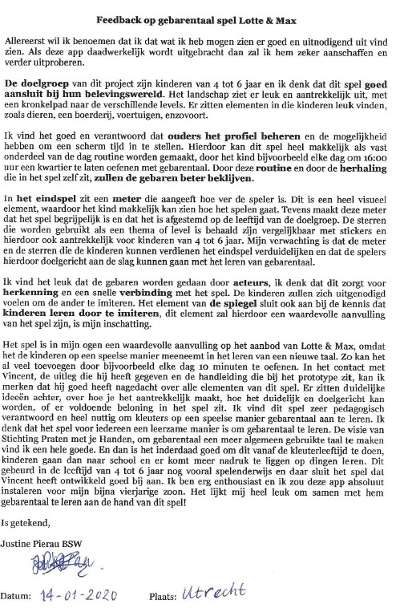

# Conclusie

Om deze vraag te beantwoorden moet worden gekeken of  het ontwerpprobleem, opgesteld aan het begin van het project, succesvol verholpen is. 

## Ontwerpprobleem 

#### "Hoe kun je er voor zorgen dat kinderen tussen 3 en 7 jaar, na het bekijken van een aflevering 'Lotte & Max' op een leuke, speelse en interactieve manier met hun opgedane kennis aan de slag kunnen?"

### De doelgroep

Uit de verschillende test met de doelgroep \(**test 0.9 en test 1.0**\) Is gebleken dat testpersonen in staat waren de app te gebruiken zonder tegen grote obstakels aan te lopen. Ook voldoet het concept bijna volledig aan alle eisen die na het ****[**onderzoek**](https://app.gitbook.com/@lotte-and-max-app/s/lotte-en-max/v/master/untitled-1) zijn opgesteld in de [**definitieve requirment list**](https://app.gitbook.com/@lotte-and-max-app/s/lotte-en-max/v/master/untitled-1/unf-conclusies)**.**  

### **Ouders met jonge kinderen**

De applicatie voldoet aan alle eisen die naar voren zijn gekomen uit [**de interviews en online survey**](https://app.gitbook.com/@lotte-and-max-app/s/lotte-en-max/v/master/untitled-1/eisen-van-ouders) ****die met deze stakeholder zijn gehouden. Ook gaven alle ouders, die ik tijdens de laatste test met de doelgroep gesproken heb, aan dat zij het een leuke en leerzame app vinden en hun kinderen er graag mee willen laten spelen als het eenmaal uitgebracht is.  

### De stichting Praten met je Handen \(Opdrachtgever\)

Oprichtster en directrice Renske Douwe Dekkers, heeft al in een vroeg stadium aangegeven enthousiast te zijn over dit concept en is al snel aan de slag gegaan om geld te verwerven en te kijken hoe het concept verder ontwikkeld kan worden in de praktijk.  

## Expert Review \(pedagoog\)

Tegen het einde van het project heb ik behoorlijk wat pedagogen en pedagogische instellingen benaderd met de vraag of zij in de mogelijkheid zijn om naar mijn concept te kijken en er daarna feedback willen geven. Na veel afwijzingen heb ik er toch een aantal gevonden. Deze konden helaas niet fysiek afspreken maar wilde wel graag een review schrijven. Na het sturen van de prototypes met een uitleg + onderbouwing, heb ik op het moment van schrijven één review mogen ontvangen. Ik verwacht dat dit er meer worden aangezien er tenminste één andere pedagoge en een kleuterjuf hebben toegezegd een review te willen schrijven.



Ondanks dat ik wist dat mijn concept aan veel eisen en leertheorieën voldeed was ik toch zeer aangenaam verrast door deze buitengewoon positieve review. Deze review heeft mij ervan overtuigd dat ik een echt leuk en bruikbaar concept heb ontwikkeld die geschikt is voor de doelgroep \(kinderen van 4 en 5\).  

### **Wat nu?**

Ik zal ten eerste dit document opsturen naar Renske Douwe Dekkers zodat zij hierop verder kan bouwen. Vervolgens zal ik eind januari met Renske afspreken om alles te bespreken en te kijken in hoeverre ik haar nog kan helpen binnen dit project. Ook wil ik graag nog één keer het concept aan Diego Molina laten zien om te vernemen wat hij ervan vindt. Hij heeft mij tijdens dit project in de goede richting geduwd en ik wil graag zijn mening over het uiteindelijke project weten. Ook wil ik voor de eindpresentatie de nieuwe mockups van 1.1 versie vervangen met de 1.0 versie, zodat ik zowel u als Renske een prototype kan laten zien van de laatste versie van mijn project.

### Aanbevelingen

Ik raad de stichting aan.

* Het gebaren diploma verder uitwerken. 
* Een MVP te maken van de 1.1 versie van mijn concept. 
* Verhaallijnen te ontwikkelen voor ieder level/thema van het spel. 
* De originele tekenaar van 'Lotte & Max', Level 1 helemaal uit te laten tekenen. 
* De optie in het oudermenu toevoegen waarin de ouder het niveau met betrekking tot gebarentaal kan aangeven. Wanneer een ouder aangeeft dat zijn of haar kind al redelijke kennis heeft opgedaan met gebarentaal, zal de acteur minder snel hints geven. Wanneer in het eindspel, het aangeven niveau _beginner_ is, zou het spel meer vergevingsgezind kunnen worden. Een beginner zou bijvoorbeeld maar een half hartje verliezen wanneer deze een fout maakt. Wel uitkijken dat de waarde van het gebarendiploma hier niet mee in het geding komt doordat speler het op deze manier makkelijker zou kunnen halen.

