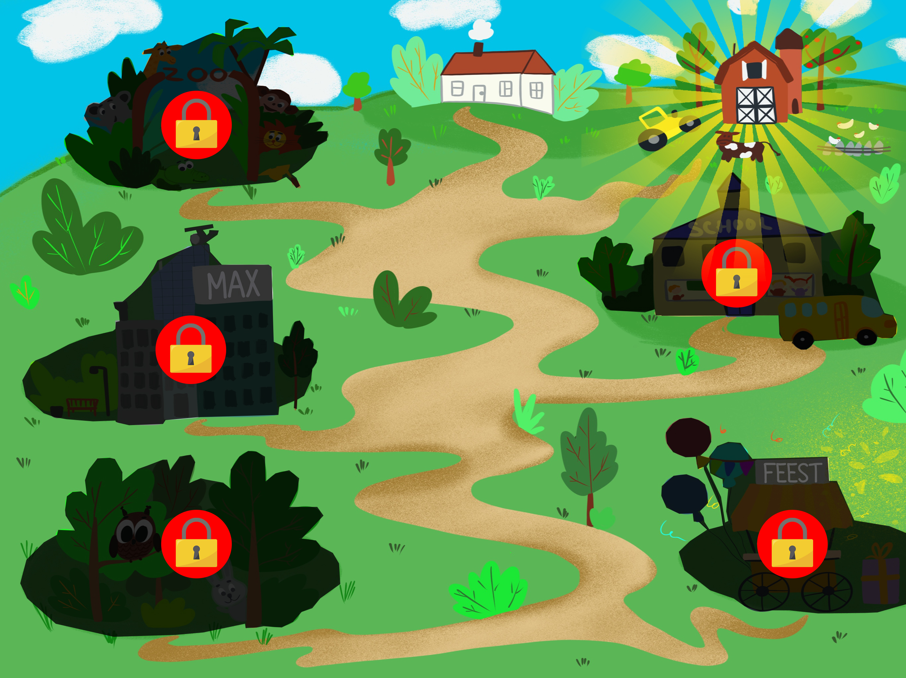
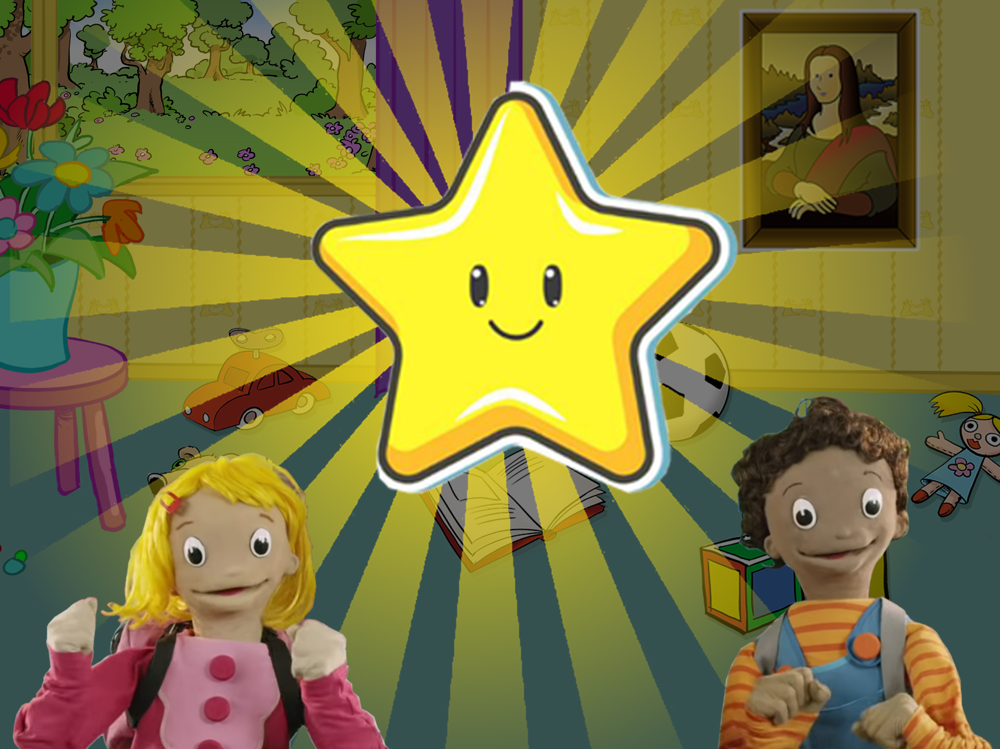

# De oplossing

## Eisen uit onderzoek.

Uit ****[**al het onderzoek** ](https://app.gitbook.com/@lotte-and-max-app/s/lotte-en-max/v/master/untitled-1/unf-conclusies)dat ik heb gedaan is de volgende requirementlist gekomen. Hier dient de oplossing grotendeels aan te voldoen om als geslaagd te kunnen worden beschouwd.



### MUST HAVES

#### Gebruikerseisen 

* De applicatie dient gebruiksvriendelijk en aantrekkelijk aan te voelen voor de doelgroep en betrouwbaar voor de ouders. 
* Eerste level\(s\) dienen makkelijk haalbaar te zijn. 
* Er moet een uitdaging in. 
* Is gericht op een niet al te brede doelgroep. 

**Functionele eisen**

* Een ouder menu waarin staat op welke leeftijdscategorie het spel gericht is en wat de bedoeling van het spel is. Indien extra betaalde content aanwezig is, moet dit in het oudermenu vermeld staan. 
* Oudermenu is moeilijk/onmogelijk toegankelijk voor de speler. ****
* Geen tekst in de applicatie. \(oudermenu uitgezonderd\) ****
* Zorg ervoor dat een speelsessie voldaan aanvoelt na minder dan 20 minuten spelen. ****
* Duidelijke visuele navigatie en indien nodig ondersteund door audio. ****
* Houd het spel simpel. ****
* Bevat een beloningssysteem en een quiz spelelement. ****
* Elementen moeten consistent werken op alle pagina’s. ****
* Bevat herhaling. ****
* Nodigt uit tot interactie \(praten, raden, meezingen, meebewegen\).

\*\*\*\*

**Context eisen** 

* Bevat situaties die voor kinderen herkenbaar zijn uit het dagelijks leven : natuur, huis- tuin en keukenartikelen, kamers in het huis, school, speeltuin etc. ****
* De speler dient middels een voice-over/acteur, door het hele spel begeleid te worden daar waar nodig \(uitleg, hulp, motivatie, beloning\). 
* Bevat geen geweld. 
* Kind dient het leuk te vinden. 
* Kan door het kind alleen gespeeld worden. 
* Prikkelt minimaal twee zintuigen tegelijk. 
* Bevat geen scherpe, harde geluiden. 
* Bevat geen enge karakters. 
* Luisteren naar instructies dient snel af te worden gewisseld met zelf spelen om de aandacht van het kind vast te houden. 
* Als er cijfers in zitten nooit hoger dan 10. 
* Uitleg beter _tijdens_ het spel dan vooraf. 
* Tone of voice is consistent.

#### 

#### Vorm eisen

* Het kind wordt begeleid middels visuele cue’s en/of een voice-over. ****
* Interface is simpel en maakt gebruik van herkenbare iconen \(pijltjes, huisje, rood, groen\). 
* Visuele decor dient uit te nodigen tot ontdekking. 
* Visueel moet er een duidelijke onderscheid zijn tussen klikbare elementen en statische elementen. 
* De call to action button \(playknop\) dient altijd de grootste en meest opvallende knop van het scherm te zijn. 
* Elementen werken consistent over de gehele app. 
* Er is een duidelijk onderscheid tussen voor- en achtergrond. 
* Stijl is 2D. 

#### 

#### Interactie eisen 

* Feedback op elke handeling die de speler verricht.  
* Vrijwel alles wordt door audio feedback ondersteund. 
* Elementen in de applicatie dienen, daar waar gepast, een geluidje en/of animatie te produceren wanneer de speler er op klikt. 
* Visuele feedback komt op verschillende manieren: animaties, kleine bewegingen, kleuren \(rood is voor fout/groen voor goed\).



### SHOULD HAVES 

#### Functionele eisen 

* Zorg dat eventuele spulletjes die gevonden en verzameld kunnen worden niet later in het spel nodig zijn om verder te komen \(houdt beloningssysteem simpel\). 
* Implementeer spelelementen die meerdere handelingen vereisen en meer dan 1 doel hebben. 
* Geluiden van veelvoorkomende acties binnen het spel dienen kort, pakkend en herkenbaar te zijn. 
* Bevat voor kinderen herkenbare geluiden \(dieren geluiden, muziek uit de serie, speelgeluiden\). 
* Moeilijk / onmogelijk voor kinderen om zelfstandig aankopen te doen. \(geen reclame\). 
* Dient een vorm van educatieve waarde te hebben. 
* Indien er getekend moet worden laat het kind dan na- of overtekenen. 
* Bevat voorbeeld figuur die gebaren voor doet en tips en/of uitleg geeft. 
* Spel dient vergevingsgezind te zijn.

#### 

#### Context eisen 

* Bevat  iets van een verhaallijn te bevatten. 
* Mits er een verhaallijn in zit, houdt deze dan kort en simpel is. 
*  Geen advertenties in het spel. 
* Richt zich op Geluid, visualisatie, kleur en gevoel in plaats van argumentatie, concentratie en feiten. 
* Prikkelt 4 zintuigen van de speler \(_zien, horen, voelen, bewegen_\). 
* Gebruik fantasiefiguren. 
* Speelt in op emotie. 
* Instructies dienen snel afgewisseld te worden met zelf spelen.

#### 

#### Vorm eisen 

* Navigatie en buttons dienen consistent te zijn op alle pagina’s en patterns te volgen uit andere games. Home button linksboven , \(rood\) kruisje om dingen af te sluiten en pijltjes om naar voren en terug te gaan. ****
* Geen uitleg scherm. ****
* Maak indien mogelijk gebruik van pijltjes buttons in plaats naar links of rechts swipen. ****
* Creëer middels felle kleuren en lieve / lachende karakters een vrolijke setting. ****
* Niet meer dan 2 bewegende elementen tegelijkertijd. ****
* Bevat voornamelijk ronde en vierkante vormen 
* Zorgt voor herkenning bij de speler.

#### 

#### Interactie Eisen

* Spel dient aan het begin makkelijk te zijn maar geleidelijk aan toe te nemen in moeilijkheidsgraad. ****
* Maakt gebruik van transities tussen levels en schermen. 
* Speler moet ook zonder consequenties kunnen spelen. 
* De oppervlakte waar puzzel stukjes heen gesleept moeten worden dient grote te zijn dan lijkt. 



### COULD HAVES 

#### Functionele eisen

* Stelt speler in staat samen met drie anderen coöperatief te leren.

#### 

#### Context eisen 

* Applicatie heeft een sociaal aspect. ****
* Bevat Rijmpjes of woordengrappen. 
* Grappige easter eggs. \(kleine  "onbelangrijke" \(verborgen\) interacties\) 



Onderstaand een overzicht ****waarop de belangrijkste Best Practises waarmee rekening gehouden dient te worden, te zien zijn.

## De focus

De uiteindelijke echte focus van de app en de belangrijkste punten waar het aan moet voldoen, zijn de volgende drie punten:

## De eindoplossing 

is een tablet applicatie gebaseerd op de DVD-serie 'Lotte & Max'. In de applicatie kan de speler door de verschillende functionaliteiten zowel gebaren leren als oefenen en is er ruimte om, zonder consequenties of doel, het spel te spelen. Vanuit het [**hoofdmenu**](https://app.gitbook.com/@lotte-and-max-app/s/lotte-en-max/~/drafts/-Lyfr4xgEM7Bq_YcssJx/v/master/het-product/1.1-toevoegingen/menu) kan de speler op ****[**een spiegel**](https://app.gitbook.com/@lotte-and-max-app/s/lotte-en-max/~/drafts/-Lyfr4xgEM7Bq_YcssJx/v/master/het-product/1.1-toevoegingen/de-spiegel) ****drukken waarnaar hij/zij zichzelf kan zien terwijl een acteur gebaren voordoet. Ook bevat het menu een grote playknop die de speler naar een [**map**](https://app.gitbook.com/@lotte-and-max-app/s/lotte-en-max/v/master/het-product/1.1-toevoegingen/map) ****brengt waar een overzicht te zien is van alle levels/thema's van het spel. [**Elk thema uit de DVD serie**](https://app.gitbook.com/@lotte-and-max-app/s/lotte-en-max/~/drafts/-LyfxxOuJdC3PQ1CIcr4/v/master/de-opdracht/de-dvd-serie) heeft zijn eigen level in het spel. Wanneer de speler op één van de locaties op de map klikt zal hij/zij in het bijbehorende level terecht komen. Hier zal de speler begroet worden door de acteur of actrice die zal vertellen wat de bedoeling is van het spel. Alle objecten in het level zijn namelijk verdwenen en het is de taak van de speler deze objecten vanuit zijn/haar [**rugtasje**](https://app.gitbook.com/@lotte-and-max-app/s/lotte-en-max/v/master/het-product/versie-1.0/creeer-de-wereld) naar de goede plek te slepen. Wanneer er een object vanuit de rugtas naar de goede plek in het level is gesleept, verschijnt er[ **een scherm** ](https://app.gitbook.com/@lotte-and-max-app/s/lotte-en-max/v/master/ontwikkeling/prototype-creeer-de-wereld/creeer-de-wereld-0.9/4.-level-1)waarop in het groot het object te zien is. Daaronder drie acteurs naast elkaar, die om de beurt een gebaar doen. De speler dient hier op de acteur te drukken die het juiste gebaar bij het desbetreffende object doet. Als de speler het goede antwoord gegeven heeft zal het object in de [**gamewereld verschijnen**](https://app.gitbook.com/@lotte-and-max-app/s/lotte-en-max/v/master/ontwikkeling/prototype-creeer-de-wereld/creeer-de-wereld-0.9/4.-level-1) en kan de speler op dit object drukken om een leuke en of grappige animatie te zien.   
  
Wanneer de speler Alle objecten succesvol in de wereld heeft weten te plaatsen zal [**het eindspel**](https://app.gitbook.com/@lotte-and-max-app/s/lotte-en-max/v/master/het-product/1.1-toevoegingen/eindspel) ****worden gestart. Bij binnenkomst zal de speler opnieuw door de acteur begroet worden en hij geeft een korte uitleg. De speler zal een aantal plaatjes van objecten te zien krijgen. Vervolgens maakt de acteur, links in beeld, een gebaar en moet de speler hier het juiste object/plaatje bij vinden. Rechts in beeld zal een meter te zien zijn die steeds meer opgevuld wordt naarmate de speler de juiste plaatjes aanklikt. Hoe meer de meter wordt opgevuld, hoe groter de beloning met als laatste beloning de gouden ster. Wanneer de speler een gouden ster weet te behalen is het level uitgespeeld. Weet de speler in ieder level, tijdens het eindspel, de gouden ster te bemachtigen dan heeft hij/zij het spel uitgespeeld en zal deze speler het gebarendiploma ontvangen.  
__

## **De functionaliteiten**

Hieronder vindt u de uitwerking en onderbouwing van alle functionaliteiten van de 1.1 versie van mijn concept/definitieve eindoplossing.

_Hoe het spel gedurende het project steeds is veranderd en aangepast, kunt u teruglezen in de productbiografie. Onder de kopjes:_  
  
[**Versie 0.9**](https://app.gitbook.com/@lotte-and-max-app/s/lotte-en-max/v/master/ontwikkeling/prototype-creeer-de-wereld)  
****[**Versie 1.0**](https://app.gitbook.com/@lotte-and-max-app/s/lotte-en-max/v/master/het-product/versie-1.0)  
****[**Versie 1.1**](https://app.gitbook.com/@lotte-and-max-app/s/lotte-en-max/~/drafts/-LygACCqUgzzbTjCYLoG/v/master/het-product/1.1-toevoegingen)\*\*\*\*

## Het menu

[**Dit is het eerste scherm**](https://app.gitbook.com/@lotte-and-max-app/s/lotte-en-max/~/drafts/-LygACCqUgzzbTjCYLoG/v/master/het-product/1.1-toevoegingen/menu) dat de speler zal zien wanneer het spel wordt geopend en bevat een aantal elementen. [**De spiegel**](https://app.gitbook.com/@lotte-and-max-app/s/lotte-en-max/v/master/het-product/1.1-toevoegingen/de-spiegel) links in beeld zal de speler naar een ander scherm brengen waarin hij zonder regels of consequenties gebaren kan leren. In het menu zal de spiegel voorzien zijn van animaties \(glinsteringen\) zodat deze opvalt en spelers er op zullen drukken. De grote paarse playknop in het midden, zal de rest van het spel in gang zetten. Deze call to action button is groot en opvallend gemaakt zodat de speler gemakkelijk weet hoe het spel gestart kan worden. Bovenin het scherm bevindt zich de knop naar [**het oudermenu**](https://app.gitbook.com/@lotte-and-max-app/s/lotte-en-max/v/master/het-product/versie-1.0/ouder-menu)**.** Zoals de naam doet vermoeden is deze uitsluitend bedoelt voor ouders/verzorgers van de speler en is daarom ook beveiligd met een kinderslot \(3 seconden ingedrukt houden\). Verder zullen de hoofdrolspelers uit de DVD-serie 'Lotte & Max' ook in beeld te zien zijn. Deze zullen licht heen en weer bewegen, knipperen met ogen en af en toe zwaaien naar de speler. Het toevoegen van Lotte & Max zal bij de speler zorgen voor herkenning wat op zijn beurt de speler een veilig en vertrouwd gevoel zal geven.

## De spiegel

De speler kan vanuit het hoofdmenu op [**de spiegel**](https://app.gitbook.com/@lotte-and-max-app/s/lotte-en-max/~/drafts/-LygDhBKgOLsoJ5EJCaW/v/master/het-product/1.1-toevoegingen/de-spiegel) ****drukken. In dit scherm kan de speler, vrij van regels of consequenties, nieuwe gebaren leren en oefenen. Bovenin het scherm kan de speler een object selecteren en vervolgens zal de acteur of actrice uit de serie het gebaar van dit object blijven doen totdat de speler op het volgende of vorige pijltje drukt. Omdat het belangrijk is dat alle buttons er door de gehele app consistent uitzien en werken worden dezelfde soort pijlbuttons ook in het [**gebarenboek**](https://app.gitbook.com/@lotte-and-max-app/s/lotte-en-max/v/master/het-product/1.1-toevoegingen/gebarenboekje) gebruikt. De speler kan terugkeren naar het menu door op de grote gele terug knop \(pijl\) te drukken, die in het hele spel linksboven staat.  
  
_Voor de volledige ontwikkeling en onderbouwing van de Spiegel verwijs ik u door naar ****_  
****[**de productbiografie.**](https://app.gitbook.com/@lotte-and-max-app/s/lotte-en-max/~/drafts/-Lynda3Mdj267YPH0q5d/het-product/1.1-toevoegingen/de-spiegel)\*\*\*\*

 **Toegevoegde waarde spiegel**

* Kind heeft plek waar het zonder regels of consequenties lekker bezig kan zijn.  
* Kind kan door in de spiegel te kijken nieuwe gebaren leren. 
* Kinderen imiteren graag en daar draait het bij de spiegel om. 
* Zet aan tot bewegen. 
* Speler zal omdat hij/zij zichzelf ziet, ook beter zien hoe een gebaar beter uitgevoerd zou kunnen worden. 
* Herkenning, acteur en actrice zijn bekend voor de kijker van Lotte & Max. 
* Speler heeft een echt persoon als voorbeeld.

## Het oudermenu

Wanneer de ouder in [**het hoofdmenu**](https://app.gitbook.com/@lotte-and-max-app/s/lotte-en-max/v/master/het-product/1.1-toevoegingen/menu) 3 seconden lang de oudermenu knop ingedrukt houdt zal het [**bovenstaande scherm verschijnen.**](https://app.gitbook.com/@lotte-and-max-app/s/lotte-en-max/v/master/het-product/versie-1.0/ouder-menu) ****Hier staat kort en duidelijk beschreven wat de bedoeling van het spel is en voor wie het bedoeld is. Omdat het voor kinderen lastig is accounts aan te maken en gegevens in te vullen wordt deze taak, middels het ouderscherm, uit handen genomen. Het ouderscherm heeft de volgende functies:

* \*\*\*\*[**Het toevoegen en verwijderen van accounts.**](https://app.gitbook.com/@lotte-and-max-app/s/lotte-en-max/v/master/het-product/versie-1.0/ouder-menu)\*\*\*\*
* [**Een maximale schermtijd instellen.**](https://app.gitbook.com/@lotte-and-max-app/s/lotte-en-max/v/master/het-product/versie-1.0/ouder-menu)\*\*\*\*
* \*\*\*\*[**Naar de website van Lotte & Max gaan.**](https://www.gebarenwebwinkel.nl/)\*\*\*\*

_In de productbiografie kunt u de uitwerkingen van_ [_de functionaliteiten van het ouder menu terugvinden._](https://app.gitbook.com/@lotte-and-max-app/s/lotte-en-max/het-product/versie-1.0/ouder-menu)\_\_

### Toegevoegde waarde van een oudermenu.

* Zorgt voor vertrouwen bij de ouders van spelers. 
* Voorkomt ongewenste aankopen, gedaan door het kind. 
* Biedt de mogelijkheid tot verschillende instellingen zonder dat kinderen er wat van merken. 
* Ontneemt lastige taken van kinderen. 
* Kan maximale speeltijd van kind beperken. 
* Geeft ouders beter begrip van de applicatie en voor wie deze is bedoeld.

## De Map Navigatie

Omdat kinderen van 4 en 5 nog niet kunnen lezen is het belangrijk dat de navigatie zonder tekst en zeer visueel wordt ontworpen. Ik heb ervoor gekozen om een map te maken waarbinnen de hele Lotte & Max wereld zich bevindt. Elke locatie op de map is een level in het spel en elk level in het spel is een thema uit de DVD-serie. Dit is een linear spel waarbij de speler bij het eerste level begint en gaandeweg iedere nieuwe locatie kan vrijspelen. Om het voor de speler zo duidelijk mogelijk te maken welke levels gespeeld kunnen worden en welke nog niet, heb ik de locaties die nog niet gespeeld kunnen worden donker gemaakt en er een slotje overheen geplaatst. Uit onderzoek naar [**educatieve games**](https://app.gitbook.com/@lotte-and-max-app/s/lotte-en-max/untitled-1/educatieve-games) ****en tijdens het spelen van de vele beschikbaar kinderspelletjes, is gebleken dat het plaatsen van slotjes over een level een veel gebruikte manier is om aan te geven dat een level nog niet toegankelijk is. Uit de [**0.9 test**](https://app.gitbook.com/@lotte-and-max-app/s/lotte-en-max/~/drafts/-Lyj786aKKQIGx8-3D9N/ontwikkeling/prototype-creeer-de-wereld/prototype-0.9-test) ****blijkt dat alleen slotjes niet genoeg zijn om het echt duidelijk te maken aan de speler. Daarom heb ik levels die nog niet toegankelijk zijn, ook donker gemaakt zodat deze minder goed opvallen.

De map is voorzien van de nodige feedback. Zo zal er naast een leuk en herkenbaar deuntje ook de stem van de acteur te horen zijn. Deze zal de speler uitleggen dat hij/zij op een locatie kan klikken om er naar toe te gaan en zal het ook melden als de speler op een locatie drukt waar een slotje op zit.  
  
Wanneer de speler een level heeft uitgespeeld zullen er bij het volgende level bewegende zonnestralen te zien zijn. Zo weet de speler zeker waar hij/zij op moet drukken. Als de speler vervolgens op dit level drukt zal het scherm eerst inzoomen op het geselecteerde level alvorens het level daadwerkelijk verschijnt \(transitie\). Op deze manier kan de speler duidelijk zien waar hij/zij heen gaat.  
  
_De volledige ontwikkeling van de navigatie kunt u teruglezen in de productbiografie onder de kopjes:_   
****[**0.9**](https://app.gitbook.com/@lotte-and-max-app/s/lotte-en-max/~/drafts/-Lyj786aKKQIGx8-3D9N/ontwikkeling/prototype-creeer-de-wereld/creeer-de-wereld-0.9/3.de-map)    
****[**1.0** ](https://app.gitbook.com/@lotte-and-max-app/s/lotte-en-max/~/drafts/-Lyj786aKKQIGx8-3D9N/het-product/versie-1.0/de-navigatie-map)    
****[**1.1**](https://app.gitbook.com/@lotte-and-max-app/s/lotte-en-max/~/drafts/-Lyj786aKKQIGx8-3D9N/het-product/1.1-toevoegingen/map)\*\*\*\*

### Toegevoegde waarde Map navigatie.

* Speler ziet duidelijk welk level hij/zij heeft vrijgespeeld. 
* Hoeft niet langer te zoeken. 
* Nodigt uit tot ontdekking. 
* Zorgt voor herkenning van de Lotte en Max locaties. 
* Overzichtelijke navigatie zonder knoppen of tekst. 
* Speler weet waar het aan toe is en wat het kan verwachten.

## **Creëer de wereld.**

Nadat de speler op een van de speelbare levels in de map heeft geklikt zal het bovenstaande scherm verschijnen. Hier zal [**de acteur**](https://app.gitbook.com/@lotte-and-max-app/s/lotte-en-max/ontwikkeling/prototype-creeer-de-wereld/creeer-de-wereld-0.9/5.-de-acteur) in een of twee zinnen uitleggen wat de bedoeling van het spel is.  
   
"_Heee goed dat je er bent!, alle spulletjes van Lotte zijn verdwenen, kan jij ze weer op de goede plek leggen?_ " - **Acteur**  
  
Dit onderdeel van het concept maakt gebruik van een click and drag systeem. Dit systeem stelt de speler in staat objecten te slepen over het scherm. Uit onderzoek naar [**educatieve games** ](https://app.gitbook.com/@lotte-and-max-app/s/lotte-en-max/untitled-1/educatieve-games)en observaties tijdens de verschillende tests met de doelgroep, blijkt dat kinderen van nature geneigd zijn objecten te slepen en geen probleem hebben met het begrijpen van dit systeem.  
  
**Belangrijke punten**

* Duidelijk onderscheid tussen sleepbare objecten en de rest van de wereld. 
*  Wanneer de speler een object vroegtijdig los laat zal deze een aantal seconden op de plek blijven liggen voor deze terug zal schieten naar de rugtas. Zo heeft de speler tijd om zichzelf tijdens het slepen te corrigeren zonder dat er frustraties ontstaan 
* Het gebied rondom de lege objecten, waar een object uit de rugtas geplaatst kan worden, is groter dan het lege vlak, zo hoeft de speler niet het object exact tot op de millimeter naar het juiste gebied te slepen. Ook dit is om verwarring en frustratie tegen te gaan. 
* Rugtas bevindt zich aan de rechterkant van het scherm in plaats van aan de onderkant, dit omdat uit de tests met doelgroep bleek dat kinderen vaak per ongeluk de middelste home button op de tablet indrukken. Hierdoor verdwijnt het spel en zal het kind al gauw om hulp roepen om het spel weer terug te kunnen vinden. Door het verplaatsen van de rugtas van het midden naar de rechterkant hoop ik het per ongeluk drukken op de homebutton zoveel mogelijk te beperken. 
* Wegens de beperkte ruimte in de rugtas zullen nieuwe objecten verschijnen wanneer een object uit de rugtas in de wereld is geplaatst. Zo kun je meer objecten in de rugtas kwijt dan op het eerste gezicht lijkt.

Wanneer de speler een object vanuit de rugtas naar de juiste plek heeft gesleept, verschijnt het volgende quiz scherm.

De acteur zal de speler vertellen dat hij/zij het goede gebaar bij de Pop moet indrukken.  
De speler heeft een keuze uit drie acteurs die om de beurt een gebaar doen. Is de laatste klaar dan begint de eerste weer. Zo hoeft de speler zich maar op één acteur tegelijk te focussen. Ook zullen de bolletjes in het kader om de acteur heen bewegen wanneer die een gebaar maakt. Als de speler het juiste antwoord heeft gegeven zullen de andere twee acteurs verdwijnen en zal de overgebleven \(goede\) acteur nog één keer in het midden van het scherm het gebaar doen \(herhaling\).

  

Als alle objecten succesvol in de wereld zijn geplaatst zal de hoofdacteur de speler feliciteren en kan de speler vervolgens op alle verschillende objecten drukken voor een korte animatie met een geluidje \(beloning\).    
  
In de rugtas zal een grote playknop verschijnen om door te gaan naar het ****[**eindspel.**](https://app.gitbook.com/@lotte-and-max-app/s/lotte-en-max/het-product/1.1-toevoegingen/eindspel) ****Deze knop zal zachtjes op en neer bewegen om de aandacht te trekken. Ook zal de acteur de speler vertellen dat hij/zij nog even met de objecten kan spelen en op de knop moet drukken om verder te gaan.

Zodra de speler op de knop drukt zal er, voordat de speler het eindspel te zien krijgt, een liedje uit de DVD-serie afspelen waarin Lotte en Max te zien zullen zijn. Uit [**de userstories van Renske Douwe Dekkers**](https://app.gitbook.com/@lotte-and-max-app/s/lotte-en-max/het-product/unf-capgemini) ****\(opdrachtgever\) blijkt dat zij het liefst heeft dat dit alleen voor betaalde klanten is omdat dit gelinkt zal zijn aan het betaalde videoplatform van 'Lotte & Max'. Het liedje op het einde van het level is dus optioneel maar zit wel in dit concept. De grote play- knop rechts in beeld zal ook terugkomen in het eindspel en er precies hetzelfde uitzien om consistent te blijven.

_Een uitgebreide uitleg en verantwoording van van het 'Creëer de wereld' gedeelte, vindt u in de productbiografie_ 

\*\*\*\*[**0.9**](https://app.gitbook.com/@lotte-and-max-app/s/lotte-en-max/~/drafts/-LyjVj4Z2jOv7R0bl7_G/ontwikkeling/prototype-creeer-de-wereld/creeer-de-wereld-0.9)  
****[**1.0**](https://app.gitbook.com/@lotte-and-max-app/s/lotte-en-max/~/drafts/-LyjVj4Z2jOv7R0bl7_G/het-product/versie-1.0/creeer-de-wereld)  
****[**1.1**](https://app.gitbook.com/@lotte-and-max-app/s/lotte-en-max/~/drafts/-LyjVj4Z2jOv7R0bl7_G/het-product/1.1-toevoegingen/rugtas)\*\*\*\*

### **Toegevoegde waarde**

* Speler leert nieuwe gebaren door trial en error. 
* Speler leert door herhaling. 
* Speler kan kennis van gebaren oefenen. 
* Geen buttons. 
* Geen tekst. 
* Leert van van echt persoon \(de acteur\). 
* Uitleg, hints en tips werken middels audio \(de acteur\). 
* Lief uiterlijk. 
* Nodigt uit tot ontdekking. 
* Doelgroep bekend met click 'n drag systeem. 
* Kan gebaren oefenen. 
* Beloning in de vorm van interactie met de objecten. 
* Simpele verhaallijn. 
* Vergevingsgezind, fout antwoord maakt niets uit.

## Het Gebarenboekje

Hoewel uit het gesprek met Renske al [**een idee** ](https://app.gitbook.com/@lotte-and-max-app/s/lotte-en-max/~/drafts/-LyjVj4Z2jOv7R0bl7_G/ontwikkeling/prototype-creeer-de-wereld/wat-vond-de-stichting-ervan#idee)naar voren is gekomen om de focus ook wat meer op het leren van nieuwe gebaren te leggen, wilde ik zelf ook nog een andere optie bedenken. Hier is het grote gebarenboekje uit voortgekomen. Dit boekje is gedurende het hele spel toegankelijk door op de het rode boekje bovenin het scherm te drukken.

Wanneer de speler op het rode vlakje met het boek drukt zal het boek als een overlay over het level komen te liggen. De speler kan hier een object kiezen om vervolgens een uitleg en voorbeeld te zien.

In het eerste scherm zal de speler alle objecten van het thema, waar hij/zij zich momenteel in bevindt, te zien krijgen. In eerdere versies kwam nog extra scherm voor waarin de speler zelf een keuze kon maken van welk thema hij/zij de objecten wilde zien. Uit de[ **1.0 test**](https://app.gitbook.com/@lotte-and-max-app/s/lotte-en-max/v/master/het-product/test-1.0) ****bleek dat dit verwarrend en onduidelijk was voor de speler. De speler zal daarom in de laatste versie van het concept alleen de objecten te zien krijgen die horen bij het thema waarin de speler zich bevindt. Wanneer de speler dus in level 1 zit is het thema "een nieuwe dag" uit de DVD-serie en zullen alleen de gebaren die in deze DVD behandeld worden hier terug te vinden zijn. Als de speler in level 2 zit zullen er in het gebarenboekje alleen objecten uit DVDV-2: boerderijdieren te zien zijn. 

Als de speler op één van de gebaren gedrukt heeft zal deze het bovenstaande scherm te zien krijgen. Hierin staat bovenaan duidelijk het object zodat de speler direct ziet waar het om gaat. Vervolgens zal er ook, middels audio, het woord  'Beer' te horen zijn. De speler kan nu op de luidspreker drukken om het woord nogmaals te horen. Hoewel het geen onderdeel van mijn project is denk ik wel dat kinderen op deze manier ook een beetje leren lezen doordat zij het object en de tekst zien en vervolgens het woord ook nog uitgesproken wordt. Onderin het beeld zal de acteur of actrice het gebaar voor doen. Wanneer de speler hier op drukt zal de video van de actrice fullscreen gaan. Nogmaals drukken waar dan ook op het scherm zal het beeld weer kleiner maken.   

### Toegevoegde waarde

* Speler kan altijd elk object uit het thema opzoeken. 
* Speler kan nieuwe gebaren leren. 
* Speler zal hopelijk ook een klein beetje leren lezen.

## Het eindspel

Na het drukken op de playknop, aan het einde van het creëer de wereld gedeelte, komt de speler bij het eindspel terecht. Hier zal de speler opnieuw door de hoofdacteur begroet worden. Deze zal de speler vertellen dat het de bedoeling is bij elk gebaar dat hij doet, de juiste afbeelding te selecteren en dat hij/zij de meter rechts in beeld helemaal moet opvullen om de ster te mogen ontvangen.  
  
Waar er in het vorige 'Creëer de wereld gedeelte' geleerd werd door het juiste gebaar bij een object te kiezen is dit in het eindspel juist andersom : van gebaar naar object. Op deze manier zullen spelers zowel de gebaren als de bijhorende objecten beter kunnen onthouden doordat er twee kanten op geleerd wordt.  
  
Uit het onderzoek [**ontwerpen voor kinderen**](https://app.gitbook.com/@lotte-and-max-app/s/lotte-en-max/~/drafts/-Lyjyyft0P2SLHI7Pttx/v/master/untitled-1/ontwerpen-voor-kinderen) blijkt dat een vorm van uitdaging in spelletjes ook steeds belangrijker wordt voor kinderen van 4 en 5. Deze uitdaging is terug te vinden in het eindspel. De speler begint namelijk met 3 levens en zal een leven kwijtraken wanneer er op een verkeerd object wordt gedrukt. Ik heb hartjes gebruikt om levens mee aan te duiden omdat dit het bekendste icoon voor een leven is waardoor kinderen dit makkelijk zullen begrijpen.  
  
Naast de mogelijkheid van het verliezen van levens en het opnieuw moeten beginnen, zit er in het spel een andere vorm van uitdaging namelijk het behalen van de ster. Deze is bovenaan de meter rechts in beeld te zien en zal vrijgespeeld worden wanneer de speler alle levels gehaald heeft.  
  
Ook maakt het eindspel gebruik van affordance \(hoe verder de speler komt, hoe moeilijker het spel wordt\). Het eindspel bestaat uit 4 levels die aangeduid worden op de meter met streepjes en smileys. Bij elk nieuw level zal het aantal antwoordmogelijkheden, waaruit de speler kan kiezen, toenemen.   
  
**Level 1:**   4 plaatjes  
**Level 2:**   6 plaatjes  
**Level 3**:   9 plaatjes  
**Level 4:**   12 plaatjes  
  
Wanneer de speler een volgend level binnen het eindspel bereikt zal deze ****een leven erbij krijgen.  

Mocht de speler al zijn of haar levens kwijt zijn voordat de meter helemaal is gevuld, dan zal hij/zij een smiley krijgen van het hoogst gehaalde level. Mocht de speler, in het tweede level,  geen levens meer hebben dan ziet dat er als volgt uit:

De speler zal een vrolijk deuntje te horen krijgen waarna de hoofdacteur de speler zal aansporen het nog een keer te proberen om een sterretje te halen of anders op de paarse play knop te drukken om naar het volgende level te gaan. Hier is gekozen voor dezelfde paarse knop als in het 'Creëer de wereld' scherm om de buttons zo consistent mogelijk te houden. De replay knop is groen omdat groen voor iets positiefs staat en ik de speler wil aansporen om het eindspel steeds opnieuw te proberen totdat de ster gehaald is.

Als de speler het voor elkaar krijgt de hele meter op te vullen, zal de meter rood kleuren en de ster animeren en ontvangt de speler de ster van dit level/thema. Hiermee heeft de speler het level uitgespeeld en zal deze het volgende scherm te zien krijgen.

De ster zal groot in beeld te zien zijn en er zal een positief liedje/tune klinken. Lotte en Max verschijnen ook in beeld om het samen met de speler te vieren. Als dit is afgelopen zal de speler terugkeren naar de Map om het volgende level te kunnen spelen. De behaalde ster zal in de map, bij het desbetreffende level, te zien zijn.

Als de speler in ieder level de gouden ster heeft behaald, is het spel uitgespeeld.De speler kent nu alle gebaren en ontvangt het gebarendiploma.  
  
_Voor de volledige ontwikkeling van het eindspel verwijs ik door naar de productbiografie onder de kopjes:_  
[**0.9**](https://app.gitbook.com/@lotte-and-max-app/s/lotte-en-max/~/drafts/-Lyk5Fh1CrBwLe_WgJei/v/master/ontwikkeling/prototype-creeer-de-wereld/creeer-de-wereld-0.9/prototype-eindgame)  
****[**1.0**](https://app.gitbook.com/@lotte-and-max-app/s/lotte-en-max/~/drafts/-Lyk5Fh1CrBwLe_WgJei/v/master/het-product/versie-1.0/de-eindgame)  
****[**1.1**](https://app.gitbook.com/@lotte-and-max-app/s/lotte-en-max/~/drafts/-Lyk5Fh1CrBwLe_WgJei/v/master/het-product/1.1-toevoegingen/eindspel)\*\*\*\*

### **Toegevoegde waarde**

* Eindspel ziet er grafisch uitnodigend uit. 
* Speler zal door de meter nu begrijpen hoever hij/zij is binnen het eindspel. 
* Speler ontvangt een beloning ongeacht hoe ver hij/zij komt. 
* Zal motivatie putten uit de ontvangst van smileys. 
* Zal sneller geneigd zijn meerdere malen het eindspel te spelen om betere smileys of de ster te kunnen krijgen \(herhaling\). 
* Doordat de speler gemotiveerd is om het eindspel vaker te spelen zal hij/zij door de herhaling ook steeds beter de gebaren onthouden en leren. 
* Speler heeft door de smileys, het sterretje en het diploma nu een doel waar het naar kan toe werken naast het vrijspelen van alle levels. 
* Gebaren kunnen door de toevoeging van het eindspel twee kanten op geleerd worden van gebaar naar object en andersom. 
* Objecten die qua ruimtegebrek of verhaaltechnisch niet in het 'Creëer de wereld gedeelte' verwerkt kunnen worden, kunnen wel terugkomen in het eindspel. Zo kunnen alle woorden uit elk thema volledig in het level worden verwerkt. 
* Het behalen van de sterren en het uiteindelijk halen van het gebarendiploma is een goed en vrij simpel beloningssysteem.  
* Spel maakt gebruik van levels zonder dat dit vermeld staat.

## \*\*\*\*

## **Eindverantwoording**

## **Beloningssystemen**

Omdat uit verschillende onderzoeken blijkt dat een \(kleine\) beloning belangrijk is om[ **extrinsieke en intrinsieke motivatie**](https://app.gitbook.com/@lotte-and-max-app/s/lotte-en-max/v/master/untitled-1/educatieve-games#educatie-games) bij kinderen teweeg te brengen is dit een belangrijk onderdeel van mijn project. In de 1.0 versie bevat mijn concept de volgende vormen van beloning.

* Voice-over complimenteert de speler wanneer hij/zij iets goed doet. 
* Slingers en ballonnen wanneer een kamer gevuld is. 
* De mogelijkheid om objecten te laten animeren wanneer zij eenmaal in de wereld geplaatst zijn. 
* Lotte & Max liedje op het einde van een level. 
* Het vrijspelen van de nieuwe levels \(ontdekking\). 
* Positief geluidje wanneer tijdens het eindspel een vraag goed beantwoord wordt. 
* Kort deuntje wanneer een level in het eindspel gehaald is. 
* Het Halen van Smiley's tijdens het eindspel. 
* Het ontvangen van de Gouden ster als het eindspel is uitgespeeld. 
* Het ontvangen van het gebarendiploma wanneer alle gouden sterren zijn verzameld.

## Hoe wordt er geleerd in dit concept?

Mijn concept maakt gebruik van vier verschillende principes als het gaat om de manier van leren en informatie binnen krijgen. Dit zijn de vier principes :.

1**.Leren door Trial en Error.**  
Omdat het spel vergevingsgezind is, maakt het voor de progressie binnen het spel niet uit als een speler een verkeerd antwoord kiest. Hierdoor kan de speler antwoorden blijven geven tot dat het goede antwoord gegeven is zonder dat daar  straf op staat. Uit het onderzoek [**ontwikkeling van jonge kinderen**](https://app.gitbook.com/@lotte-and-max-app/s/lotte-en-max/v/master/untitled-1/eigenschappen-van-kleuters) is gebleken dat jonge kinderen, onder andere, leren door trial en error. Hierdoor zullen zij in het spel onthouden welke objecten _niet_ bij bepaalde gebaren horen waardoor het ook weer makkelijker wordt te bepalen welk gebaar er _wel_ bij hoort.  
  
2. **Herhaling**  
Ook herhaling komt uit het onderzoek [**de ontwikkeling van jonge kinderen**](https://app.gitbook.com/@lotte-and-max-app/s/lotte-en-max/v/master/untitled-1/eigenschappen-van-kleuters) naar voren als een belangrijk principe om te leren. Binnen het spel en vooral binnen het eindspel, krijgt de speler te maken met herhaling. Om te beginnen is het hele spel al een herhaling omdat alle gebaren uit de serie terug zullen komen in het spel. In het 'Creëer de wereld gedeelte' komt de herhaling terug tijdens het quiz gedeelte. De 3 acteurs waaruit gekozen dient te worden, zullen namelijk een voor een het gebaar steeds weer opnieuw voordoen totdat de speler een keuze gemaakt heeft. Daarna zal de acteur, wanneer de speler eenmaal de goede acteur bij het object gekozen heeft,  nog één keer in het midden van het beeld het gebaar doen zonder afleiding van de andere twee acteurs. Hierna zal het object ook nog een keer groot in beeld verschijnen zodat de speler nogmaals ziet welk object bij welk gebaar hoort.  
  
In het eindspel zal een speler die nog niet zo bekwaam is in gebarentaal, meerdere poging moeten doen om tot het laatste level binnen het eindspel te komen. Om deze reden zal de speler ook meerdere keren hetzelfde gebaar naar een object moeten vertalen. Er zal hier dus geleerd worden door een combinatie van herhaling en trial en error.

3.  **Multisensorisch leren**  
In dit concept wordt ook gebruik gemaakt van  [**multisensorisch leren**](https://app.gitbook.com/@lotte-and-max-app/s/lotte-en-max/v/master/untitled-1/hoe-leren-kleuters/leren-door-te-doen)**.** Hierbij gaat het erom dat het kind in kwestie tijdens het leren middels meerdere zintuigen, geprikkeld worden. De vier zintuigen waar het hierbij om gaat zijn:  

**1. Auditief**  
Draait om het zintuig **"horen"**. het geluid kan helpen om dingen beter te begrijpen.  
  
**2. Tactiel**  
Draait om het zintuig **"tasten"**, alles wat met voelen en aanraken te maken heeft.  
  
**3. Visueel**  
Draait om het zintuig **"zien",** zien hoe iets werkt of reageert helpt bij het begrip krijgen van iets.  
  
**4. Kinetisch**  
Draait om "**beweging"**, door dingen op te schrijven of na te doen onthoud je informatie beter.

De speler zal tijdens het spel allereerst **visueel** geprikkeld worden. De speler kan middels de acteurs gebaren zien, kan de objecten die bij de gebaren horen zien en zien bewegen en zal feedback krijgen wanneer hij/zij iets goed of fout doet. Het feit dat er middels een app geleerd en geoefend wordt zal de speler op **tactiel** gebied stimuleren, de speler is namelijk hands-on bezig met de stof. De acteur en voice-over \(dezelfde persoon\) zullen bijdrage aan **auditieve** prikkels. Naast het uitspreken van het object wanneer deze naar de juiste plek gesleept is, zal de acteur tips geven om de speler te helpen wanneer hij/zij er niet uit komt en uitleg geven waar bepaalde gebaren uit ontstaan zijn. Op dit moment wordt de speler nog niet heel erg **kinetisch** geprikkeld. Natuurlijk zal de hoofdacteur de speler af en toe aanmoedigen om een gebaar zelf te proberen maar doordat het een tablet applicatie is wordt de speler _laten bewegen_ moeilijk. Indirect zou de app wel het bewegen kunnen stimuleren. Jonge kinderen spelen namelijk graag dingen na die zij gezien of geleerd hebben. Onbewust zullen zij op deze manier dingen beter kunnen begrijpen en verwerken. De kans zit er dik in dat kinderen na het spelen van het spel gebaren uit het spel gaan na doen wat uiteindelijk ook het doel is van de stichting.  
  
4. **Theorie van Gagné.**  
Ook is er rekening gehouden met de theorie van Gagné die ervoor zou moeten zorgen dat kinderen nieuwe gebaren kunnen leren en onthouden. Deze theorie vindt u terug in het onderzoek [hoe leren kinderen?](https://app.gitbook.com/@lotte-and-max-app/s/lotte-en-max/v/master/untitled-1/hoe-leren-kleuters)

**1.Gaining attention  \(trek de aandacht\).**  
Door de kleurrijke en vrolijke omgeving van het spel en de acteur die de speler gericht en op meerdere momenten toespreekt, wordt de aandacht van de speler vastgehouden.

**2.Informing the learner of the objective \(Leg uit wat de bedoeling is\).**  
De acteur zal zowel in het 'Creëer de wereld gedeelte' als het 'Eindspel' kort, bondig en duidelijk uitleggen.  
  
**3.Presenting the stimulus material \(Maak duidelijk wat er geleerd moet worden\).**  
Het zal de speler niet ontgaan dat het spel om leren en oefenen van gebaren gaat.  
  
**4.Providing learning guidance \(biedt adequate hulp daar waar nodig\).**  
Binnen het spel is ruimte voor de speler om zelf dingen te ontdekken. Wel zal de acteur de speler hints, tips en voorbeelden van gebaren geven als het spel merkt dat speler er niet uitkomt.   
  
**5**.**Eliciting the performance** **\(oefening en herhaling\).**  
Middels de spiegel en het 'Creëer de wereld gedeelte' kan de speler zijn kennis oefenen. De herhaling zit hem vooral in het eindspel waar de speler net zo vaak en lang kan oefenen totdat de ster behaald is.  
  
**6.Stimulating recall of prerequisite learning \(stimuleer eerder opgedane kennis\).**  
De speler zal de gebaren en de kennis die zij hebben opgedaan door te kijken naar de DVD- serie, in de applicatie kunnen testen.  
  
**7.Providing feedback \(Biedt voldoende feedback aan\).**  
Vrijwel iedere functie/element  binnen het spel, is voorzien van visuele en auditieve feedback.  
  
8. **Assessing the performance**  **\(zorg dat de kennis getoetst kan worden\).**  
Zowel in het 'Creëer de wereld gedeelte' als in het 'Eindspel' zal de kennis van gebaren getest worden.  
  
9. **Enhancing retention and transfer \(Blijven oefenen om op lange termijn te kunnen blijven onthouden\)**  
Ik hoop dat dat app een blijvend effect op de speler zal hebben en dat hij/zij in het dagelijks leven ook nog gebaren blijft doen.

## **Hoe spreek dit concept de doelgroep aan?**

Dit concept probeert kinderen aan te spreken door de volgende principes te verwerken in het spel:

**Kleurrijk.**  
Kinderen houden van kleur, vaak hoe feller en tegenstrijdiger hoe beter. Het gehele spel maakt daarom gebruik van een uiteenlopend en fel kleurenpalet.

**Herkenbaarheid.**  
Jonge kinderen zullen iets wat zij herkennen sneller leuk en vertrouwd vinden. Omdat de app gebaseerd is op de al bekende DVD-serie, herkennen de spelers Lotte en Max, objecten, omgeving en acteurs. 

**Vriendelijk.**  
Het spel heeft een vrolijke feeling en wordt ondersteund door leuke geluiden en liedjes uit de serie. De acteur zal ook altijd de speler op een vrolijke manier verwelkomen en aanspreken. Het spel bevat geen geweld of negatieve thema's.

**Vergevingsgezind & uitdagend.**  
Om kinderen aan te spreken moet er een goede balans zijn tussen het zorgeloos spelen en uitgedaagd worden. Door de combinatie van het 'vergevingsgezinde puzzel en quiz gedeelte' en het uitdagende eindspel komen deze twee punten goed samen.

**Nodigt uit tot ontdekking.**  
Door het toevoegen van de map die een overzicht geeft van de hele wereld van 'Lotte & Max', zal de speler gemotiveerd worden om alle levels uit te spelen, ze hebben dan de hele wereld ontdekt. Ook het feit dat alle objecten een eigen animatie hebben \(wanneer deze succesvol in de wereld geplaatst zijn\) zal ertoe bijdragen dat de speler wordt uitgedaagd op alle objecten te drukken om te zien wat er gebeurt. Als laatste nodigt de algehele kleurrijke en vrolijke sfeer de kinderen uit het spel te proberen.  
  
**Motivatie.**  
Ik hoop dat de spelers van het spel zowel intrinsieke als extrinsieke motivatie zullen putten uit het spelen van het spel.  
  
De [beloningsystemen](de-oplossing.md#beloningssystemen) die hierboven uiteengezet zijn zullen de speler extrinsiek moeten stimuleren om het spel verder te willen spelen en om hogerop in het spel te komen.  
  
Het feit dat kinderen gebaren leren en zich hierdoor beter kunnen uiten, draagt bij aan de  Intrinsieke motivatie.De Lotte & Max App

In dit document zal alleen de laatste versie van de oplossing met alle functionaliteiten besproken worden. Voor de volledige ontwikkeling van de 0.9 tot de 1.1 versie verwijs ik u door naar [**de productbiografie.**](https://app.gitbook.com/@lotte-and-max-app/s/lotte-en-max/~/drafts/-Lyfr4xgEM7Bq_YcssJx/v/master/het-product)  
  
****[**In hoeverre de applicatie voldoet aan de vooraf opgestelde eisen vindt u hier** ](https://app.gitbook.com/@lotte-and-max-app/s/lotte-en-max/~/drafts/-LynnQZELHJPsDfEXvsn/het-product/eindverantwoording)\*\*\*\*

