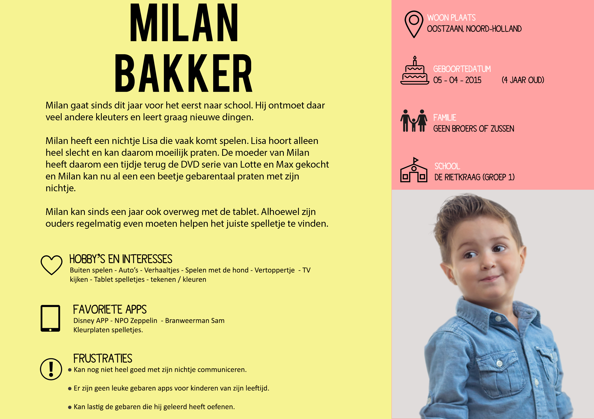

# Het project

## **Introductie** 

Na een half jaar lang min of meer aan het lijntje gehouden te zijn door De Landmacht tijdens mijn vorige afstudeerproject was het tijd om hier afstand van te doen en een nieuw project te vinden. Afgelopen jaar, tijdens mijn stage, heb ik nieuwe connecties opgedaan waaronder Stefany Rietkerk. Stefany is managing director bij Artcore Productions. Via Stefany ben ik in contact gekomen met Renske Douwe Dekkers, oprichter van de non-profit organisatie 'Praten met je handen. 'Zij heeft de DVD-serie “Lotte & Max’’ ontwikkeld waarin Lotte en Max kleine kinderen gebarentaal leren. Renkse wilde graag nog een _extra_ element aan de DVD-serie toevoegen. Dit element moet ervoor zorgen dat wat de kinderen net geleerd hebben van Lotte en Max ook door de ouders en de kinderen kan worden getest. Stefany heeft Renske met mij in contact gebracht om te kijken of ik haar kan helpen met het bedenken en ontwikkelen om een geschikte oplossing te bedenken voor dit extra element.

## Context 

Dove kinderen \(en volwassenen\) hebben het niet gemakkelijk in onze samenleving. Omdat zij zichzelf niet horen is hun uitspraak voor andere vaak moeilijk te verstaan. Hiernaast is gebarentaal een taal op zich en is niet één twee drie geleerd. En, mocht je als dove wel een gebarentaal beheersen, dan heb je hier alleen wat aan als degene waarmee je praat ook deze gebarentaal beheerst. Op dit moment komt dat vrij zeldzaam voor. Stichting ‘Praten met je Handen’ probeert daarom, middels een dvd serie, kinderen vanaf 0 jaar te introduceren met gebarentaal. Samen met Lotte en Max, de hoofdrolspelers in de serie, leren de kinderen via verschillende thema’s de basis van gebarentaal. Kinderen leren en onthouden over het algemeen gemakkelijker dan volwassenen waardoor de drempel om gebarentaal te leren veel kleiner is dan voor volwassenen. 

Naast de DVD-serie wil Renske graag nog nog een applicatie toevoegen aan de wereld van Lotte & Max. Tijdens onze eerste meeting heb ik bedacht dat het misschien interessant zou zijn om iets te ontwikkelen waarmee de ouders hun kinderen kunnen testen of waarbij de kinderen zichzelf kunnen testen op hun kennis van gebarentaal. Deze app zou naadloos moeten aansluiten op de DVD-serie. Bij de ontwikkeling van de applicatie zal onderzoek gedaan moeten worden naar de verschillende leermethoden voor zowel dove als goed horende kinderen en moet er worden gekeken hoe je de applicatie goed kan laten aansluiten met de DVD serie.  
  
Een uitgebreide uitleg van de Stichting Praten met je Handen en Oprichtster, directeur Renske Douwe Dekkers, vindt u hier:  [**De stichting**](https://app.gitbook.com/@lotte-and-max-app/s/lotte-en-max/~/drafts/-LyeHFz3iFRYv6MSJElP/de-opdracht/de-stichting)\*\*\*\*

## Probleemsituatie 

Vanuit de opdrachtgever is het probleem dat zij op zoek is naar een manier om naast de DVD-serie 'Lotte & Max' ervoor te zorgen dat kinderen de betekenis van gebaren kunnen oefenen en zichzelf kunnen testen op de gebaren die zij van Lotte en Max hebben geleerd. De meer algemene probleemsituatie is dat buiten dove-en slechthorende om, weinig mensen gebarentaal spreken. Dit maakt het voor dove-en slechthorende lastig om met niet-dove mensen te communiceren. Door het kijken van de DVD -serie kunnen jonge kinderen de basis van gebarentaal leren. Het probleem vanuit de kijker van de DVD-serie is dan ook:  
  
1.  **Geen manier om opgedane kennis uit de DVD-serie te vergroten of te testen.**  
  
2.  **Geen goede speelse apps op de markt om gebarentaal te leren/oefenen.**

3.  **Na afloop van een aflevering 'Lotte & Max' geen interactie mogelijk.**  

## Ontwerpprobleem 

_Hoe kun je er voor zorgen dat kinderen tussen de 3 en 7, na het bekijken van een aflevering 'Lotte & Max', op een leuke, speelse en interactieve manier met de opgedane kennis aan de slag kunnen?_

## **Design Challenges** 

#### **1.Hoe kun je kinderen stimuleren, na het kijken van een aflevering, zichzelf te testen op de verschillende gebaren middels een applicatie?**

* Hoe houd je kinderen gemotiveerd om zich met de gebaren bezig te houden doen?
* Hoe kun je de doelgroep laten leren en oefenen in 1 applicatie?
* Hoe zorgen andere populaire educational apps ervoor dat kinderen gemotiveerd blijven?
* Is het mogelijk om ervoor te zorgen dat kinderen van 3 het leuk vinden maar ook kinderen van 6 jaar en hoe doe je dit? 

#### 2.Hoe zorg je ervoor dat ouders de meerwaarde van de app erkennen en bereid zijn deze te downloaden voor hun kinderen?

* Wat vinden ouders belangrijk als het gaat om de screentime van hun kind.
* Waar letten ouders op bij het kiezen van een app voor hun kind? 

#### 3. Hoe kun je de applicatie zo ontwerpen dat het voor kinderen makkelijk te gebruiken is?

* Wat zijn goede patterns en design principles voor kinderen?
* Wat zijn de meest populaire apps voor kinderen?
* Wat voor andere gebarentaal apps bestaan er? 

#### 4.Is het mogelijk één oplossing te realiseren voor de doelgroep kinderen van 0 t/m 6 jaar?

* Wat zijn de voornaamste verschillen in denkvermogen en gedrag tussen de jongste en

  oudste kinderen binnen de doelgroep?

* Is het noodzakelijk dat zowel kinderen van 0/1 anders worden aangesproken dan die van 6 of 7?

#### 5.Moet er een beloningssysteem in de applicatie zitten?

* Zijn er soortgelijke applicaties die ook een beloningssysteem hebben geïmplementeerd?
* Wat voor beloningssystemen zijn er?
* Wat voor beloningssystemen worden er gebruikt voor jonge kinderen?

## De doelgroep.

Vanuit de organisatie kwam naar voren dat de doelgroep van de DVD-serie kinderen van 0 t/m 6 is. Uit [**onderzoek**](https://app.gitbook.com/@lotte-and-max-app/s/lotte-en-max/~/drafts/-LyeHFz3iFRYv6MSJElP/untitled-1/eigenschappen-van-kleuters) is gebleken dat deze doelgroep een enorme ontwikkeling doorgaan. Interesses en vaardigheden van jonge kinderen zullen snel veranderen en beter worden.  
  
Uit het onderzoek [**educatieve games**](https://app.gitbook.com/@lotte-and-max-app/s/lotte-en-max/~/drafts/-LyeHFz3iFRYv6MSJElP/untitled-1/educatieve-games) ****komt naar voren dat experts met klem aanraden om te ontwerpen voor een beperkte leeftijdscategorie. "_Dus voor kinderen van 5 en 6 en niet van 6 tot 12"_  
Ook wordt afgeraden kinderen jonger dan 2 te introduceren met digitale media.  
  
Tijdens het uitvoeren van de [**0.9 test** ](https://app.gitbook.com/@lotte-and-max-app/s/lotte-en-max/~/drafts/-LyeHFz3iFRYv6MSJElP/ontwikkeling/prototype-creeer-de-wereld)en [**1.0 test**](https://app.gitbook.com/@lotte-and-max-app/s/lotte-en-max/~/drafts/-LyeHFz3iFRYv6MSJElP/het-product/test-1.0) ****is mij opgevallen dat kinderen van 6 al meer actiespelletjes spelen en niet langer geïnteresseerd zijn in puzzelspelletjes.  
  
Om deze redenen is mijn uiteindelijke doelgroep **kinderen van 4 en 5.  
  
Onderling zijn er behoorlijk wat verschillen tussen kinderen. Uiteindelijk zal de oplossing gewoon speelbaar zijn voor alle kinderen, alleen is deze specifiek ontworpen voor de doelgroep kinderen van 4 en 5.**

\*\*\*\*

## **Stakeholders.**

De volgende stakeholders, eisen en persona's zijn opgesteld op basis van de volgende onderzoeken.  
  
****[**De Stichting.**](https://app.gitbook.com/@lotte-and-max-app/s/lotte-en-max/~/drafts/-LyeHFz3iFRYv6MSJElP/de-opdracht/de-stichting)  
****[**De ontwikkeling van jonge kinderen.**](https://app.gitbook.com/@lotte-and-max-app/s/lotte-en-max/~/drafts/-LyeHFz3iFRYv6MSJElP/untitled-1/eigenschappen-van-kleuters)  
****[**Ouders met jonge kinderen.** ](https://app.gitbook.com/@lotte-and-max-app/s/lotte-en-max/~/drafts/-LyeHFz3iFRYv6MSJElP/untitled-1/eisen-van-ouders) ****















De persona's kunt u ook terugvinden in de productbiografie onder het kopje  [**Persona's**](https://app.gitbook.com/@lotte-and-max-app/s/lotte-en-max/~/drafts/-LyeHFz3iFRYv6MSJElP/untitled-1/unf-conclusies/personas)**.**

\*\*\*\*

  
  
  
  
  
**Bronnen:**  
Treehouse Practice \(asset\) Ouders ****[https://www.treehousepractice.ie/insformation](https://www.treehousepractice.ie/insformation)

Clipartmail \(asset\) kinderen plaatje [https://www.clipart.email/list/day/71](https://www.clipart.email/list/day/71)

\*\*\*\*

